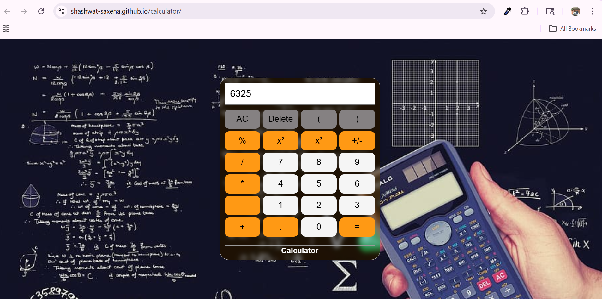

# Calculator App

A simple and responsive Calculator application built using HTML, CSS, and JavaScript.  
This project performs basic arithmetic operations with a clean and user-friendly interface.

---

## 🚀 Features

- Addition, Subtraction, Multiplication, Division
- Responsive Design
- User-friendly Interface
- Real-time Calculation
- Clear Button Functionality

---

## 🛠️ Tech Stack

- HTML
- CSS
- JavaScript

---

## 📸 Screenshot



---

## 📂 Project Setup

1. Clone the repository

```bash
git clone https://github.com/Shashwat-Saxena/calculator
